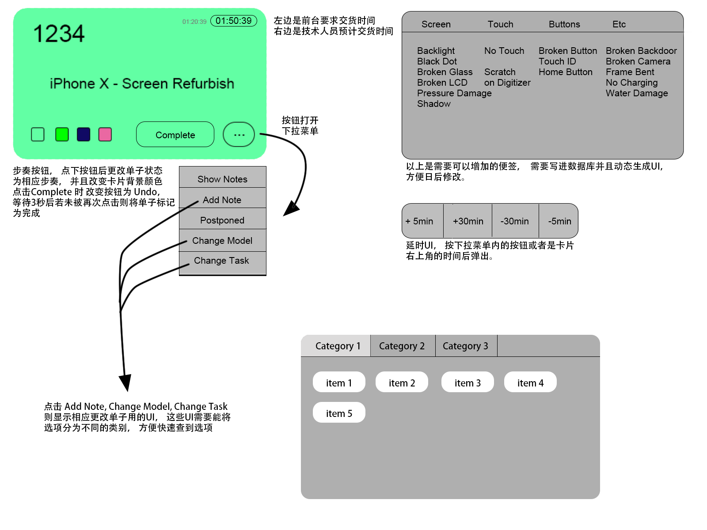

[回到主页](../README.MD)

## 后台网页是面向员工的管理网页， 具体功能如下：
-   编辑客户信息
    -   允许前台添加“未注册”的客户账户， 如果有email地址， 则自动发送email邀请客户注册密码。
-   显示订单
    -   为技术人员分配订单
-   编辑订单信息
    -   编辑便签
        -   便签分为公开便签和私有便签， 公开便签客户也可以查看， 私有便签只有员工可以查看
    -   修改订单状态
        -   订单状态例如： 已预约， 已收到设备， 正在拆机， 正在换屏， 正在测试， 已就绪， 已完成等。
    -   收款
-   显示结账报告

### 第一阶段：
-   消息中心
    -   显示当前状态
        -   正在进行的单数
        -   快要到期的单数
        -   今日已完成单数
    -   搜索栏
        -   通过任何一项客户信息搜索客户， 或者通过单号搜索订单
    -   列表
        -   显示最近的数个订单， 或者是搜索结果
-   权限
    -   禁止客户类型用户访问后台
### 第二阶段：
-   建单界面
    -   选择或者添加客户
    -   选择设备机型
    -   选择服务项目
        -   通过网页报价自动添加默认价格
    -   完成建单后立刻打开订单， 方便添加附加便签
    -   自动添加VIP折扣
    -   同客户连续添加多个订单
-   编辑客户界面
    -   添加客户时自动查找相似的已有客户， 防止给同一个客户添加多个账户
    -   手动调整、合并重复账户
    -   允许搜索疑似重复的账户 （账户email 或者是 电话 相同， 方便并合账户
-   订单细节显示页面
    -   通过网页控制打印机
        -   打印设备标签
            -   单号
            -   交单时间
            -   便签
        -   打印订单收据
        -   打印付款收据
        -   打印结账报告
            -   营业额
            -   客户消费额
            -   连锁店消费额

-   订单列表显示界面
    -   前台以及技术人员的显示界面不同：
        -   [技术人员的界面](#技术人员的界面)应该凸显订单当前状态， 交单时间。 方便修改状态或者是添加额外记录。
        -   [前台人员的界面](#前台人员的界面)应该凸显单号， 机型， 客户等信息， 并且可以对订单进行更全面的修改。
        -   弹射消息： 当员工修改、添加便签的时候， 相关人员应收到消息通知变更。

### 第三阶段：
-   收发短信/Email
    -   当订单状态变为完成时， 自动告知客户
    -   向订阅我们的客户群发邮件
-   屏幕保险列表
    -   搜索保险服务
    -   统计保险销量以及碎屏次数
-   屏幕保险申请管理页面
    -   显示过去的申请历史
    -   许可/拒绝客户的保险申请
    -   向客户发送信息
        -   要求更多信息
        -   给出拒绝原因
    -   提示可疑行为
        -   同个客户或者IMEI短期内多次申请
-   在线客服
    -   通过网站在线和客服人员聊天， 或者使用编辑好的FAQ回答常见问题。

--------------------

## 技术人员的界面

*技术人员的界面应该将订单以卡片的方式显示到屏幕上， 不同的技术人员的设备应该显示不同的卡片， 例如负责拆机的人员应该只显示正在拆机这个部奏的卡片, 一个技术人员可以负责多个部奏。 卡片应该按照交单时间来排序。*

界面元素初步设计如下：

------------------------

## 前台人员的界面

*前台人员需要能够快速将客人的信息登入系统， 并且可以快速的查单，查客户。设计前台系统时， 应该尽量减少不必要的点击， 将多个部奏放在一页内完成。